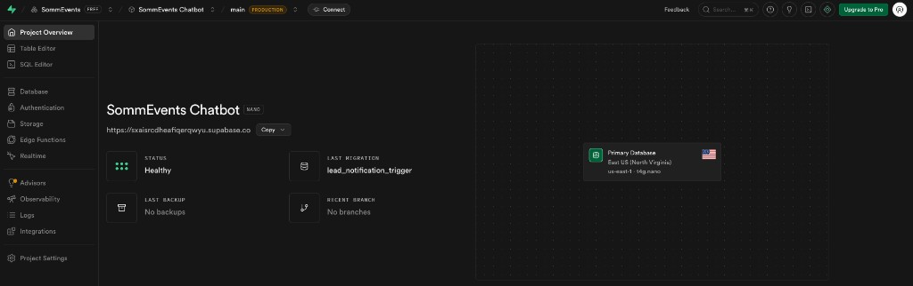
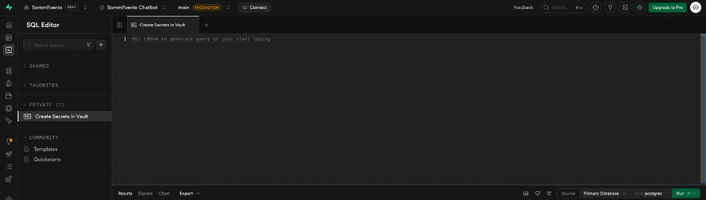
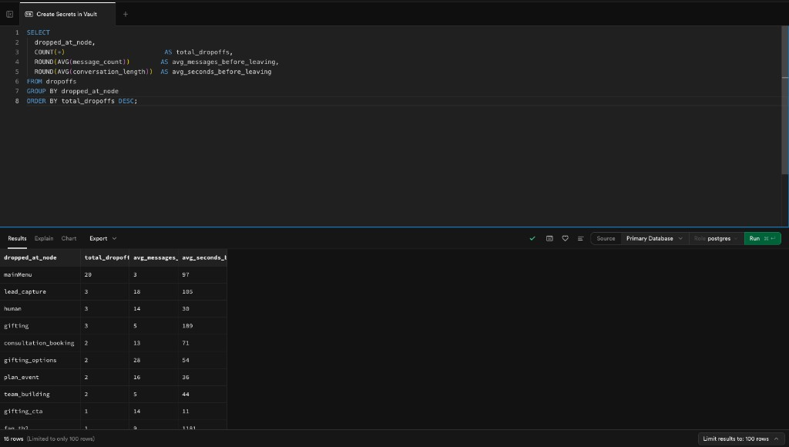

# SommEvents Chatbot — How to Check Where Users Drop Off

This guide shows you how to find out **where people leave the chatbot**, **how far they get**, and **who submitted their contact info** — all from the Supabase dashboard.

No coding required. Just copy, paste, and click **Run**.

---

## Getting Started

### Step 1: Open your Supabase project

Go to [supabase.com/dashboard](https://supabase.com/dashboard) and click on the **SommEvents Chatbot** project. You'll see the project home page:



### Step 2: Open the SQL Editor

In the left sidebar, click **SQL Editor**. You'll see a blank editor where you can type or paste queries:



### Step 3: Paste a query and click Run

Copy any of the queries below, paste it into the editor, then click the green **Run** button (bottom right). The results will appear in a table underneath:



That's it! Each section below has a ready-to-use query you can copy and paste.

---

## What the Data Means

The chatbot tracks three things automatically:

| What | When it's recorded | Why it matters |
|---|---|---|
| **Drop-offs** | A visitor closes the chat before finishing | Shows where people lose interest |
| **Completed sessions** | A visitor finishes the conversation and rates it | Shows what a successful visit looks like |
| **Leads** | A visitor submits their name/email | Shows who's actually interested |

---

## Queries You Can Run

### 1. Where are people leaving?

This is the most important query. It shows **which screen** causes the most people to close the chat.

Copy and paste this:

```sql
SELECT
  dropped_at_node                  AS screen,
  COUNT(*)                         AS times_people_left,
  ROUND(AVG(message_count))       AS avg_messages_before_leaving,
  ROUND(AVG(conversation_length)) AS avg_seconds_in_chat
FROM dropoffs
GROUP BY dropped_at_node
ORDER BY times_people_left DESC;
```

**How to read the results:**
- **screen** — the chatbot step the person was on when they closed the chat (see the [Screen Name Reference](#screen-name-reference) at the bottom)
- **times_people_left** — how many people left at that screen
- **avg_messages_before_leaving** — how many messages they saw before leaving
- **avg_seconds_in_chat** — how long they were in the chat (in seconds)

> If you see a lot of people leaving at `mainMenu`, they opened the chat but didn't click anything. If they leave at `event_lead_capture`, they got all the way through but didn't fill out the form.

---

### 2. Where are people leaving this week?

Same as above, but only shows the last 7 days:

```sql
SELECT
  dropped_at_node AS screen,
  COUNT(*)        AS times_people_left
FROM dropoffs
WHERE dropped_at >= NOW() - INTERVAL '7 days'
GROUP BY dropped_at_node
ORDER BY times_people_left DESC;
```

You can change `7 days` to `30 days` or `24 hours` to adjust the time window.

---

### 3. Which part of the chatbot loses the most people?

Instead of showing individual screens, this groups them into sections so you can see the bigger picture:

```sql
SELECT
  CASE
    WHEN dropped_at_node IN ('mainMenu', 'mainMenu_return')
      THEN 'Main Menu'
    WHEN dropped_at_node LIKE 'plan_event%'
      OR dropped_at_node LIKE 'event_%'
      THEN 'Plan a Corporate Event flow'
    WHEN dropped_at_node LIKE 'team_%'
      OR dropped_at_node LIKE 'tb_%'
      THEN 'Team Building flow'
    WHEN dropped_at_node LIKE 'gifting%'
      THEN 'Gifting flow'
    WHEN dropped_at_node LIKE 'wine%'
      THEN 'Wine Tasting flow'
    WHEN dropped_at_node LIKE 'not_sure%'
      THEN 'Not Sure / Help Me Decide flow'
    WHEN dropped_at_node LIKE '%lead_capture%'
      THEN 'Lead Capture form'
    WHEN dropped_at_node IN ('human', 'human_contact')
      THEN 'Talk to a Human'
    WHEN dropped_at_node LIKE 'faq%'
      THEN 'FAQ section'
    ELSE 'Other (' || dropped_at_node || ')'
  END AS section,
  COUNT(*) AS times_people_left
FROM dropoffs
GROUP BY section
ORDER BY times_people_left DESC;
```

---

### 4. How many people finish vs. leave?

Shows the overall completion rate:

```sql
SELECT 'Finished the conversation' AS status, COUNT(*) AS total FROM sessions
UNION ALL
SELECT 'Left without finishing'    AS status, COUNT(*) AS total FROM dropoffs;
```

---

### 5. How many people filled out a form vs. didn't?

```sql
SELECT
  CASE
    WHEN lead_captured THEN 'Submitted their info before leaving'
    ELSE 'Left without submitting info'
  END AS outcome,
  COUNT(*) AS total
FROM dropoffs
GROUP BY lead_captured;
```

---

### 6. Who submitted their contact info?

Shows all leads (name, email, phone) with the conversation context they went through:

```sql
SELECT
  name,
  email,
  phone,
  context->>'path' AS conversation_path,
  context->>'tags' AS intent_tags,
  context->>'duration' AS seconds_in_chat,
  captured_at
FROM leads
ORDER BY captured_at DESC
LIMIT 50;
```

> **Tip:** The `conversation_path` column shows the exact screens the person visited before filling out the form. The `intent_tags` show what they were interested in (e.g. Sales_Event, Sales_Gifting).

---

### 7. How many leads per day?

Shows a daily trend so you can spot patterns:

```sql
SELECT
  DATE(captured_at) AS day,
  COUNT(*)          AS leads_that_day
FROM leads
GROUP BY day
ORDER BY day DESC
LIMIT 30;
```

---

### 8. What's the average rating?

Shows overall satisfaction and engagement:

```sql
SELECT
  ROUND(AVG(rating), 1)           AS average_rating,
  ROUND(AVG(message_count))       AS avg_messages_per_chat,
  ROUND(AVG(conversation_length)) AS avg_chat_duration_seconds,
  COUNT(*)                        AS total_completed_chats,
  COUNT(*) FILTER (WHERE lead_captured) AS chats_that_captured_a_lead
FROM sessions;
```

---

### 9. What did each individual person do before leaving?

This shows the exact path each person took through the chatbot before closing it. Useful for understanding specific user behavior:

```sql
SELECT
  dropped_at_node  AS left_at,
  path_taken       AS screens_they_visited,
  message_count    AS messages_seen,
  conversation_length AS seconds_in_chat,
  lead_captured    AS filled_out_form,
  dropped_at       AS when_they_left
FROM dropoffs
ORDER BY dropped_at DESC
LIMIT 25;
```

**How to read `screens_they_visited`:** It's an ordered list like `["mainMenu", "plan_event", "event_date_check"]`. Read left to right — that's the exact sequence the person followed.

---

### 10. Quick daily check — how did yesterday go?

One query that gives you yesterday's numbers:

```sql
SELECT
  (SELECT COUNT(*) FROM dropoffs
   WHERE dropped_at >= CURRENT_DATE - 1 AND dropped_at < CURRENT_DATE)  AS people_who_left,

  (SELECT COUNT(*) FROM sessions
   WHERE started_at >= CURRENT_DATE - 1 AND started_at < CURRENT_DATE)  AS completed_chats,

  (SELECT COUNT(*) FROM leads
   WHERE captured_at >= CURRENT_DATE - 1 AND captured_at < CURRENT_DATE) AS leads_collected;
```

---

### 11. Plan a Corporate Event — step-by-step funnel

If you want to see exactly how far people get through the event planning flow:

```sql
SELECT
  dropped_at_node AS step,
  COUNT(*)        AS people_who_left_here
FROM dropoffs
WHERE dropped_at_node IN (
  'plan_event',
  'event_date_check',
  'event_date_specific',
  'event_date_month',
  'event_date_exploring',
  'event_guests',
  'event_location',
  'event_support',
  'event_budget',
  'event_atmosphere',
  'event_lead_capture'
)
GROUP BY dropped_at_node
ORDER BY people_who_left_here DESC;
```

---

## Screen Name Reference

When you see a screen name in the results, here's what it means:

| Screen name | What the user was seeing |
|---|---|
| `mainMenu` | The first menu (new visitors) |
| `mainMenu_return` | The first menu (returning visitors) |
| `plan_event` | "What kind of event are you planning?" |
| `event_date_check` | "Do you have a date in mind?" |
| `event_date_specific` | "What date are you considering?" (typed answer) |
| `event_date_month` | "What month or timeframe?" (typed answer) |
| `event_date_exploring` | "Roughly when are you hoping to host?" (typed answer) |
| `event_guests` | "How many guests?" |
| `event_location` | "City, venue, or region?" |
| `event_support` | "What level of support?" |
| `event_budget` | "Budget range?" |
| `event_atmosphere` | "What kind of atmosphere?" |
| `event_lead_capture` | The contact form (name, company, email, phone) |
| `team_building` | Start of Team Building flow |
| `tb_group_size` through `tb_lead_capture` | Steps in the Team Building flow |
| `gifting` | Start of Gifting flow |
| `gifting_quantity` through `gifting_lead_capture` | Steps in the Gifting flow |
| `wine` | Start of Wine Tasting flow |
| `wine_participants` through `wine_lead_capture` | Steps in the Wine flow |
| `not_sure` | Start of "Help Me Decide" flow |
| `not_sure_size` through `not_sure_lead_capture` | Steps in the discovery flow |
| `human` | "Talk to a Human" options (Call / Email / WhatsApp) |
| `human_contact` | The human handoff contact form |
| `consultation_booking` | Calendly booking prompt |
| `pricing` | Pricing information |
| `faq_*` | Any FAQ question |

---

## Tips

- **Run the "Where are people leaving?" query once a week** to spot trends early.
- If a lot of people leave at a specific step, the question at that step might be confusing or the options might not fit their situation.
- If people leave at `mainMenu`, the chatbot might not be grabbing their attention — consider updating the welcome message.
- If people leave at a `lead_capture` screen, they're interested but don't want to fill out a form — consider reducing the number of fields.
- You can click **Chart** (next to "Results" at the bottom) to visualize query results as a bar chart.
- You can click **Export** to download results as a CSV file to share with your team.
